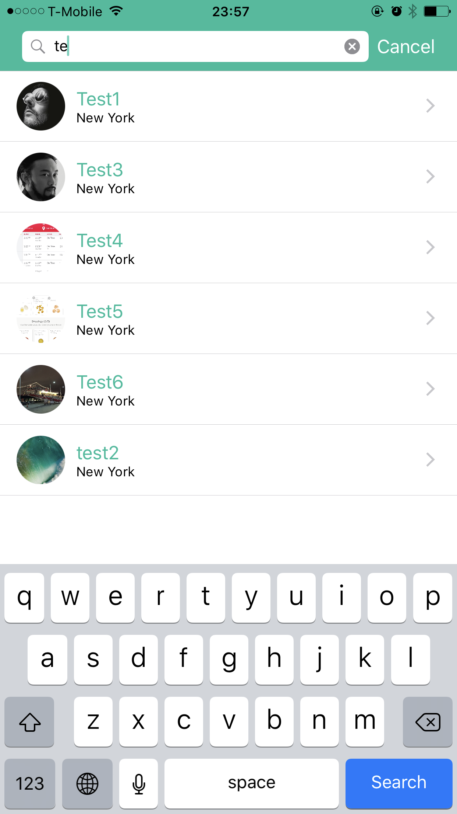
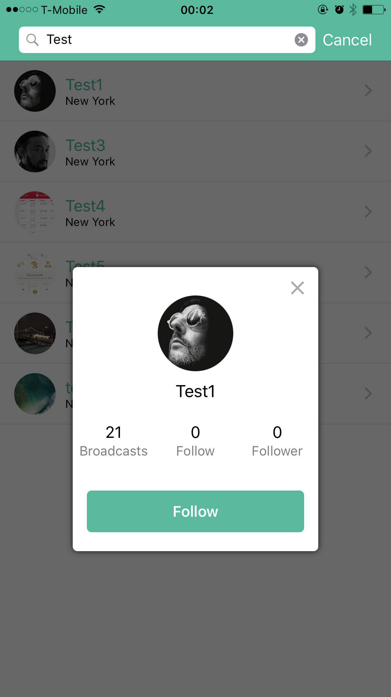
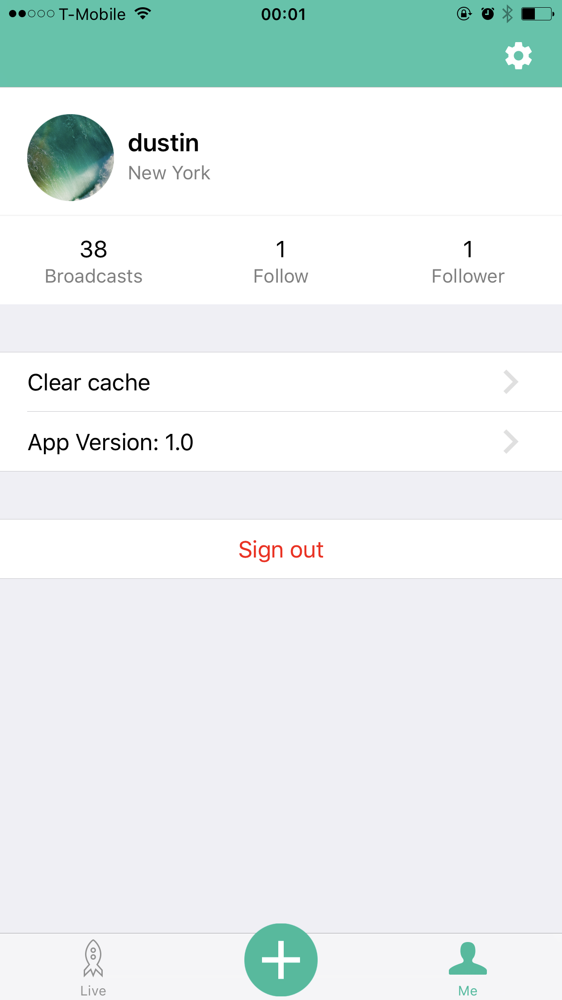

# Boomcast is a livestream platform. 

## Future work
- Add auto layout
- Instance messaging with friend.
- Improve app performance.
- organize code
- Stronger live room.
- Implement setting

##Screenshots
- Home page: show broadcast list. Click profile image will display detail user information. Click one broadcast will join the live room.

	

- Search User Page: search users by input keywords. 

	

	

- Live room page: View Live stream. Chatting and follow user.

	

- Profile Page: show user's basic information.

	

